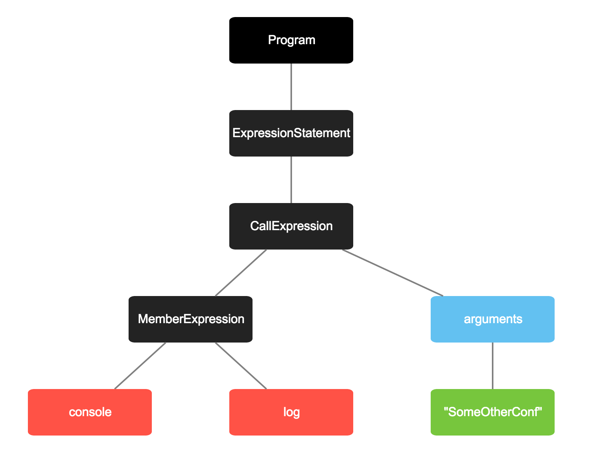

## Harnessing the power of Abstract Syntax Trees

---

# [fit] *__Parsers__* 

^ take JavaScript and turn it into a AST

---

```js
console.log("UtahJS");
```

---


---
```js
{
	type: "Program",
	body: [
		{
			type: "ExpressionStatement",
			expression: {
				type: "CallExpression",
				callee: {
					type: "MemberExpression",
					computed: false,
					object: {
						type: "Identifier",
						name: "console"
					},
					property: {
						type: "Identifier",
						name: "log"
					}
				},
				arguments: [
					{
						type: "Literal",
						value: "UtahJS",
						raw: "\"UtahJS\""
					}
				]
			}
		}
	]
}
```

^ In JavaScript an AST is basically a JSON representation of your code.I know what you're thinking. You like the other version better?
I do to. Let's stick with pictures...

---


^ Isn't that betteR?

---

# ASTs are Everywhere

^ They're in browsers, in transpilers, minifiers. All of the cool build tools these days 
are relying on ASTs to safely turn your code into play doe.

---


# [fit] *__Acorn__*

^ is the parser to beat these days

^ it's used by babel, so you know it's good.

---

# [fit] *__Espree__*

^ Is the parser I know the best. It's a fork off esprima, with better ES6 stuff and it's what we use in ESLint.
Which I work on a bit.

---

# An *__AST__* gives you super powers

^ I mentioned already that an AST is basically a JSON representation of your code.
^ But I didn't mention that they can give you actual super powers. 
^ Once you understand how ASTs work you can use them to build things that have never been built before.
^ That change how we interact with our programs. 
^ In case you think I'm messing with you, let's build something amazing! Right here. Right now.


---

# JS Aware <br> *__git diff__*

^ This is just an example of the cool things you can do with ASTs.

---

# *__Version 1__*

1. Create an AST from the new file and the old file
2. Run a tree-diffing algorithm
3. Display the differences in something nice


^ Let's break down how we'll achieve this spectacle.

---
 


---



^ okay, first change. Let's give this same talk somewhere else. We cahnged UtahJS to someotherConf.

---


^ second change. we don't like other conferences. so instead of console.log wec all console.error.

---

^ let's diff this using normal `git giff`

---

Picture of a tree with 2 limbs in different places

---

Picture of thew new tree with everything representing the changes

---

> If we had not grafted in these branches, the tree thereof would have perished
-- Jacob 5:18

^ I know whatyou're thinking. You've seen this before. In Sunday School.

---

So let's build that.

---

# still not helpful enough

---

# *__Version 2__*

Traverse both ASTs looking for imporant things to compare:

- Function inputs & outputs
- Imports / Export

^ this starts to get interesting. With this approach we can usefully compare two version of a file and see
a higher level overview of what changed without having to get into the nitty gritty of the code.

---

# How could this be useful?

---

```js
// person.js
var user = require("user");

function getAge() {
	return user.get("age");
}

function getName() {
	return user.get("name");
}

module.exports = {
 name: getName(),
 age: getAge()
};
```

---
```js
var db = require("db");

function getAge() {
	return db.get("age");
}

function getName() {
	return db.get("name");
}

module.exports = {
 age: getAge()
 name: getName(),
};
```

---
```js
var db = require("db");

function getAge() {
	return db.get("age");
}

function getName() {
	return db.get("name");
}

module.exports = {
 age: getAge()
 name: getName(),
};
```

---

# [fit] Getting Started

^ Now that i've hopefully wowed you with the possibilities, let's talk about getting started
in learning how to deal with ASTs.

---

2 things we need to know

---

Tooling

^1. What tooling is available to help tame these beasts

---

What does the JS AST look like?

^2. What does this AST look like

---

How many of you use *__babel__*?

^ To the first point. How many of use use babel?
I would definitley recommend looking at Babel Plugins as a great place to start if you're
interested in writing these "codemod" tools that change your JS from one thing to another.

---


^ Let's take a look at the example repo. It's 1 actual file. 

---

```js
module.exports = function (Babel) {
  return new Babel.Plugin("plugin-example", {
    visitor: {
      FunctionDeclaration: function (node, parent) {
        var id = node.id;
        node.type = "FunctionExpression";
        node.id   = null;

        return Babel.types.variableDeclaration("var", [
          Babel.types.variableDeclarator(id, node)
        ]);
      }
    }
  });
}
```

^ 15 lines of code. this is fractal level of how a tiny bit of code can lead to huge changes. And what do you have to know? Not very much!
What they rely on here is basic knowledge of the AST format. They're talkin about `FunctionDeclaration`s and basically replacing them with
`FunctionExpression` wrapped in a `VariableDeclaration`. It's not rocket science, but it can take your code to the moon.

---


```
   [  ]
    /\
   /  \
  /    \
[  ]  [  ]
```

^ Here's a tree.

---


#Quest2ions?